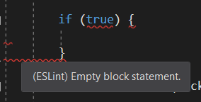

## Annoying but Eye-Opening
After a week of using ESLint with VSCode, I’ll be honest—it felt kind of annoying at first. Every time I saved my file, I got hit with a wall of warnings and errors: “This variable isn’t used,” “Missing semicolon,” “
Strings must use singlequote.” It felt like the program was yelling at me nonstop. But once I started fixing the errors, I noticed something: over time, I started predicting what ESLint was going to complain about before the squiggly red line appeared. Now when I look back at my code, I can see that it does look a little cleaner. For small files, the difference isn’t huge—it mostly feels like a minor nuisance. But I can imagine that once the codebase gets bigger, the impact of having a consistent style would really start to show. For now, it’s a bit of extra work, but I get why these rules matter.

## Consistency Makes Code Easier to Read
Another thing I’ve noticed is that coding standards make my code easier to read—not just for others, but for myself. When everything follows the same style, I don’t have to stop and think about formatting or double-check what a piece of code is doing because of inconsistent spacing or odd naming. Instead, I can focus on the logic. It’s kind of like good handwriting: if it’s neat and consistent, you don’t even notice it, but if it’s sloppy, it slows you down. I can imagine that on a big project with multiple people, this consistency would be even more important, since everyone would be able to quickly understand each other’s work without getting distracted by style differences.

## Final Thoughts
I also realized that these “small” rules actually help me build better habits. For example, ESLint doesn’t just nag me about semicolons—it also catches unused variables, overly complex functions, or inconsistent naming. Each of these things might seem trivial on its own, but together they push me to write cleaner, more intentional code. Over time, these habits become second nature, and I think that’s where the real value lies. So, are coding standards painful or useful? Honestly, they’re both. In the end, I think coding standards are less about nitpicking and more about creating good habits.
