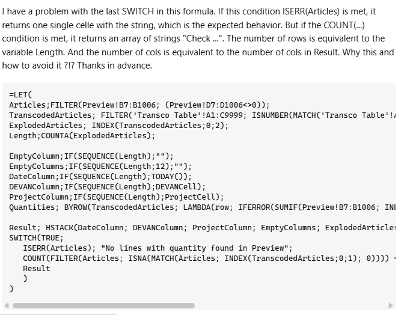
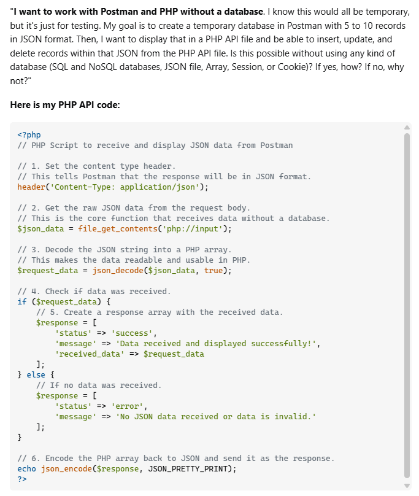

## Smart Questions: Why they are Important

Effective communication is a core skill for software engineers, particularly in open-source communities where collaboration depends on clear, precise, and actionable information. Eric S. Raymond’s essay, How to Ask Questions the Smart Way, outlines best practices for formulating questions to maximize the likelihood of receiving helpful responses while minimizing wasted effort for both the asker and the community. A well-structured question saves time, encourages engagement, and promotes learning. It allows responders to quickly understand the issue and provide accurate solutions. Clear questions are more likely to receive thoughtful and detailed answers, fostering a collaborative environment conducive to learning and problem-solving. Conversely, vague and poorly constructed questions can lead to misunderstandings, wasted time, and frustration for both parties.

## Example of an Effective Question

The first [question](https://stackoverflow.com/questions/79762594/why-excel-formula-returns-an-array) adheres to Raymond's guidelines by clearly stating the problem, providing context, and being specific. The title sufficently describes the issue, and the question implies that the user has encountered unexpected behavior when using float instead of int. The focus on a particular aspect of programming—type conversion and its effects on computations—demonstrates a well-defined problem. 

## Example of a Poorly Constructed Question and Its Consequences

In contrast, the [second question](https://stackoverflow.com/questions/79762562/i-want-to-work-with-postman-and-php-without-a-database) is a question titled "I want to work with Postman and PHP without a database?" This question violates several of Raymond's guidelines. The title is vague and does not provide enough information about the problem. There is no explanation of what the user has tried or the expected outcome. The question does not include code snippets or error messages that could help diagnose the issue. These shortcomings make it challenging for responders to provide a definitive solution. The responses to this question are varied and less focused. Some users attempt to answer, but the lack of detail makes it challenging to provide a definitive solution. The ambiguity leads to confusion and inefficiency, demonstrating how poorly framed questions can hinder the assistance process.

