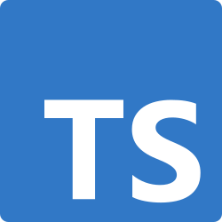

TypeScript is the first static typing language I have tried and its learning curve is difficult. On top of having to learn JavaScript in a short amount of time, the syntax of TypeScript makes it espically difficult to learn. At first I didn't see the appeal of TS, but after seeing errors in compile-time instead of runtime and the readibility makes troubleshooting and debugging very easy, I can see why TS is better for larger scale projects with a large team. TS feels more fluid and I imagine feels like using a better JavaScript, while Java - the language I am most used to - feels much more structured or formal and is much harder to spot an error in an IDE. 

I can tell TS is an amazing language, the readibility, pointing out errors before even running the algorithm, the user expierence, it is all quite great. Even a beginner to software enginnering like me can tell that the possibilities and capabilities of this language is better than most. It combines the flexibility of JavaScript and the safety of static typing encouraging me to experiment with the data growing my project.

Athletic software engineering and the WODs are fun. While I think it can be a bit stressful, it is really helpful. At home I would work on projects very meticulously since I have almost infinite time. However with these timed WODs, it helps me program faster, see where I struggle the most, and builds my focus. It is also a bit enjoyable, since I view it sort of like a game instead of practice. Being able to practice applying solutions to problems under pressure showed how slow I code in a real-world programming scenario. Over time, I think this training will help me not only become more efficient but also more confident in my coding skills.
