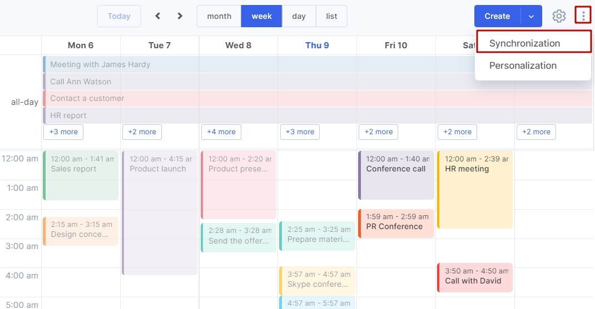

One project I would like to make is creating a full-stack web application of a task tracker for schoolwork and daily activities. This app would log study sessions along with the subject, and track the hours over weeks. You would have a target of how many hours you would want to study each day or week for every subject you had. It would also keep track and remind you to start homework assignments earlier. It would not be limited to school-related work, it could also remind you to do daily tasks like to workout today, do chores, or make time for your hobby. 

On the backend, I would design and implement the database schema, build RESTful APIs, and manage authentication so that users could securely create and access their accounts. On the frontend, I would design a clean, intuitive interface that is both mobile-friendly and accessible. I would also implement data visualizations, possibly using libraries like Chart.js or D3.js, to make the analytics engaging and easy to understand. Finally, I would handle deployment and maintenance, learning how to host the application on a platform like AWS, Heroku, or Vercel.

For this project I imagine I will gain valuable practice in writing maintainable code, and boost my organizational skills, setting clear milestones and using version control. I also think that i will improve my problem-solving skills since I would have to teach myself several new frameworks and tools. I would have to carefully troubleshoot my errors since I won't have a set of fresh eyes on the project. Completing this project would not only improve my technical expertise in full-stack development but also prepare me for both individual and collaborative projects in the future.

I would hope it would look something like Google Calendar:

  

